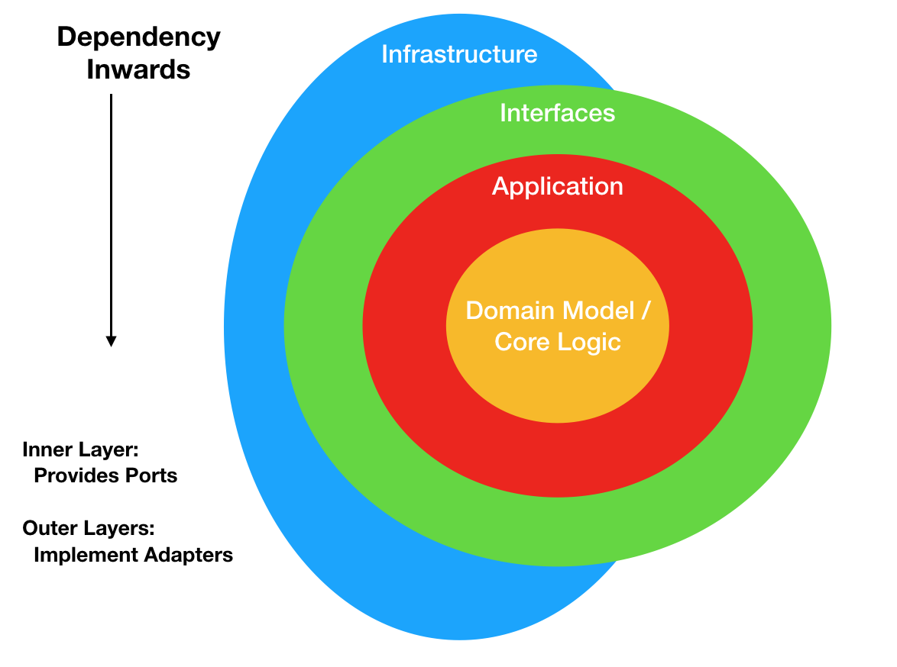

# Ports and Adapters



Ports and Adapters is a layering approach that is useful for building maintainable software solutions.
It is even consideres by some as "timeless architecture". 
 
Ports and Adapters focuses on building a technology free domain and uses the concepts of primary and secondary ports.

Reade more below or here:

* https://8thlight.com/blog/uncle-bob/2012/08/13/the-clean-architecture.html
* http://www.dossier-andreas.net/software_architecture/ports_and_adapters.html

# Layers:
The different layers are:

## Domain Layer

* Technology Free Domain Model
* In Ubiquitous Domain Language
* Potent and easy to understand 

## Application Layer

* Applications API and Services
  * Developed around use cases in the application requirements 
* This use cases orchestrate the flow of data to and from the entities
 * Somehow form the „Application API" (for development)
 
## Interfaces
Set of adapters that convert data from the 
format most convenient for the 
use cases to the format most convenient for 
some external agency/access 
(like Web / DB or in general some outer layer)
.
This layer contains things like:
* web controller / api controller
* data transfer objects (dto) or form representations for the external "world"

## Infrastructure

This layer is where all the details go. The Web is a detail. 
 The database is a detail.  We keep these things on the 
 outside where they can do little harm.

This is also where frameworks and tools such as the Database live.

Also the  communication with other external systems (APIs) will live here.


# Ports and Adapters

We are taking the description from http://www.dossier-andreas.net/software_architecture/ports_and_adapters.html

Read is carefully its nice:

* A **port** is an entry point, provided. It defines a set of functions.


* **Primary ports (Input Ports)**  
are the main API of the application. They are called by the primary adapters that form the user side of the application. Examples of primary ports are functions that allow you to change objects, attributes, and relations in the core logic.  (= MVC)

* **Secondary ports (Data ports)** (Interfaces that need to be implemented)
=interfaces for the secondary adapters. They are called by the core logic. An example of a secondary port is an interface to store single objects. This interface simply specifies that an object be created, retrieved, updated, and deleted. It tells you nothing about the way the object is stored.


# Ports and Adapters in Flamingo

## Example

Lets define a Secondary port inside your domain:


```go
package domain

type (
	MyCustomerService interface{
		GetCustomer(string) Customer
	}
)
```

Now lets write a Secondary Adapter inside the **infrastructure** layer

```go

package infrastructure

type (
	MyCustomerServiceAdapter struct {
		apiClient APIClient
	}
)
// verify interface
var _ domain.MyCustomerService = &MyCustomerServiceAdapter{}

func (m *MyCustomerServiceAdapter) GetCustomer() {
	//do some stuff with the API
}

// Inject dependency into MyCustomerServiceAdapter
func (svc *GetCustomer) Inject(a APIClient) {
	svc.apiClient = a
}
```

Then bind in your Adapter in the *module.go* using Dingo:

```go
// Configure DI
func (m *MyModule) Configure(injector *dingo.Injector) {
	// ...
  injector.Bind(new(MyCustomerService)).To(new(MyCustomerServiceAdapter))
  // ...
}
```
